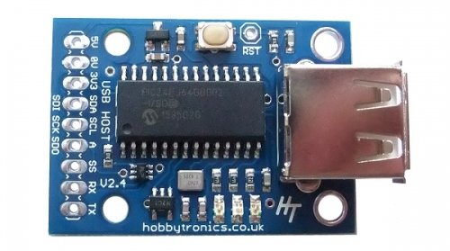
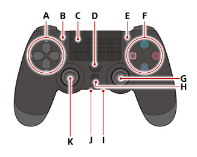
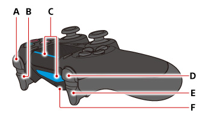

# PS3 and PS4 Dualshock Controller (Bluetooth) - USB Host

[PS3 and PS4 Dualshock Controller (Bluetooth) - USB Host](https://www.hobbytronics.co.uk/ps3-ps4-controller-bluetooth?keyword=ps4)
- [USB Host Board v2.4](https://www.hobbytronics.co.uk/usb-host-board-v24)
- [CSR Bluetooth 4.0 USB Adapter Dongle](https://www.hobbytronics.co.uk/bluetooth-4-dongle)
- [Screw Terminals 0.1" (2.54mm) Pitch (3-Pin)](https://www.hobbytronics.co.uk/3pin-screw-terminal-01in?keyword=screw%20terminals)
- [PS4 DUALSHOCK wireless controller](https://manuals.playstation.net/document/gb/ps4/basic/pn_controller.html)

## Synching with your PS3 Controller

Just as with any bluetooth connection, the Bluetooth Dongle and your PS3 Controller have to be synched in order to communicate. With the PS3 controller, this is not done using the usual 4-digit passkey method. Instead, it is done by storing the Bluetooth Address of the dongle into the PS3 controller.

**NOTE** The software needs to know what type of controller is connected and the default is for a PS4 controller. This will need to be changed to PS3 in the configuration settings (see below)

Synching the PS3 controller with the bluetooth dongle only needs to be done once.

The code makes synching very straightforward; just follow these steps.

1. Power up the USB Host board
2. Plug the Bluetooth dongle into the USB Host board. The Bluetooth Address will be read and stored on the USB Host board
3. Unplug the dongle and plug in your PS3 controller using a USB cable. The bluetooth address will now be sent and stored in the PS3 controller.
4. Unplug the PS3 controller and plug the Bluetooth dongle back in. Press the power button on the PS3 controller.
5. The LED's on the PS3 controller will flash for a few seconds, then LED1 will go solid red and the motors will rumble briefly - you are connected.

## Synching with your PS4 Controller

Just as with any bluetooth connection, the Bluetooth Dongle and your PS4 Controller have to be paired in order to communicate.

Pairing the PS4 controller with the bluetooth dongle only needs to be done once.

The code makes pairing very straightforward; just follow these steps.

1. Power up the USB Host board with the Bluetooth Dongle plugged into the USB socket
2. Blue LED should be flashing
3. Briefly connect either the SDO (A) or SS pin to GND
4. Blue LED should be flashing FASTER
5. Press and hold the PS4 and Share buttons together on the PS4 controller until the PS4 led starts flashing.
6. The units should now pair and connect.
7. When connected the motors will rumble and the LED will turn solid blue (default)

## Configuration Settings

Configuration can be done by sending commands via the serial port. Either by microcontroller or via a terminal program and a suitable serial TTL connection. Commands take effect immediately and are stored in Eeprom on the board.

The following Commands are available.

|Command|Description|
|:---:|:---:|
|DEVICE \<value\>|Select Playstation controller that will be connected [PS3\|PS4] **Default: PS4**|
|SERIAL \<value\>|Set Serial Output ON/OFF [ON\|OFF] **Default: ON**|
|HEX \<value\>|Set Serial Hex Output ON/OFF [ON\|OFF] **Default: OFF**|
|BAUD \<value\>|Set Serial Port Baud Rate [2400\|4800\|9600\|14400\|19200\|38400\|57600\|115200] **Default 9600 (we recommend using 115200)**|
|I2C \<value\>|Set I2C Address [1-127] **Default: 41**|
|RGB \<value\>|Set PS4 LED RGB value when connected (PS4 only) **Default 0000A0**|
|SYNC \<value\>|Display SYNC how-to information for specified controller|

## Reading the Data

As mentioned, there are two ways to obtain the PS3/PS4 data from the USB Host board. Either by simple serial output or by using I2C communication. Although the standard serial output is meant primarily for testing the controller, the serial HEX output has a useful purpose if you want to transmit the data wirelessly (e.g. to control a UAV or robot) as it can be fed directly into an XBee radio (or similar) for easy transmission.

The default settings are for Serial Output ON and Hex ON. For testing purposes it is recommended to turn the Hex output OFF first.

### Serial Data Output

The Serial data output (non-hex) is designed for testing purposes and is human readable in decimal values.

For decoding using a microcontroller, use the fixed format HEX output instead

The Serial Data output looks like the following

`PS4,129,128,128,128,90,94,0,0,000000000000000000,0,0,0\r\n`

Joystick and pressure outputs are comma delimited, whilst the button presses are not. Each line is terminated with a `CRLF`.

### HEX Serial Data Output

### I2C Data Output

- Pin 1. 5V
- Pin 2. GND
- Pin 3. 3.3V
- Pin 4. SDA
- Pin 5. SCL
- Pin 6. SDO(A)
- Pin 7. SS
- Pin 8. RX
- Pin 9. TX

**Front**

- A. Directional buttons
- B. SHARE button
- C. Touch pad/Touch pad button. Press the touch pad to use the touch pad button.
- D. Speaker
- E. OPTIONS button
- F. triangle button/circle button/cross button/square button
- G. Right stick/R3 button. Press down on the stick to use it as the R3 button.
- H. PS button
- I. Stereo headset jack
- J. Extension port
- K. Left stick/L3 button.Press down on the stick to use it as the L3 button. 

**Top**

- A. R1 button
- B. R2 button
- C. Light bar. The light bar on the touch pad does not glow on the CUH-ZCT1 series.
- D. L1 button
- E. L2 button
- F. USB port